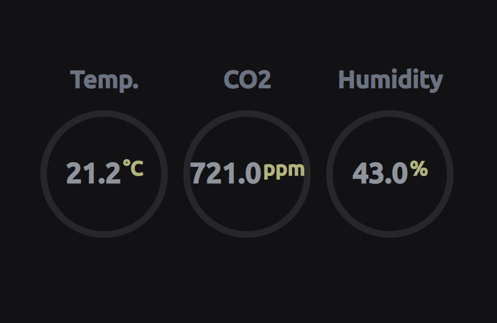

# AirLog

AirLog is a self-hosted, embedded Linux application designed to monitor and display indoor air quality metrics (**CO2, Temperature, and Relative Humidity**). 

Built as a learning journey into custom embedded Linux development with the **Yocto Project** and modern UI design with **Qt 6**.

As for now only **scarthgap** is supported.

---

## 📸 Preview

---

## 🏗️ Project Architecture & Repositories

The project is split into two distinct repositories to separate the underlying operating system configuration from the application logic:

* **[`code-airlog`](https://github.com/wakeLanaka/code-airlog):** The core application logic. Written in C++ utilizing **Qt 6**, it handles reading sensor data from the I2C bus, processing metrics, and rendering the touchscreen user interface.
* **[`meta-airlog`](https://github.com/wakeLanaka/meta-airlog):** A custom Yocto/BitBake metadata layer. It contains the recipes required to build the minimal Linux distribution, configure hardware interfaces (I2C, Touchscreen), package the Qt6 application, and autostart it via systemd on boot.

---

## 🛠️ Hardware Stack

* **Board:** Raspberry Pi 4 Model B
* **Display:** Raspberry Pi Touch Display 2
* **Sensor:** Sensirion **SCD41** (CO2, humidity, and temperature sensor)

---

## 🚀 Features

* **Real-time Monitoring:** Low-latency display of CO2 (ppm), Temperature (°C), and Humidity (%).
* **Embedded Optimization:** Boots directly into the Qt6 application via a lightweight `systemd` service.
